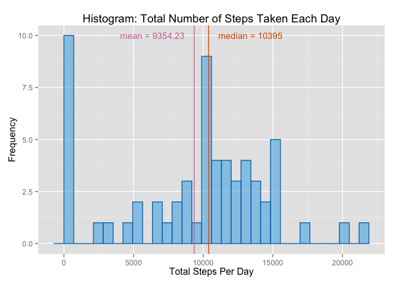

# Reproducible Research: Peer Assessment 1

## Table of Contents
- [Loading and preprocessing the data](#loading-and-preprocessing-the-data)
- [What is mean total number of steps taken per day?](#what-is-mean-total-number-of-steps-taken-per-day)
- [What is the average daily activity pattern?](#what-is-the-average-daily-activity-pattern)
- [Imputing missing values](#imputing-missing-values)
- [Are there differences in activity patterns between weekdays and weekends?](#are-there-differences-in-activity-patterns-between-weekdays-and-weekends)

## Set global options
As of version 2, R Markdown no longer attaches the knitr package by default. (See [Migrating from R Markdown v1][1])

```r
# Use :: operator to properly reference opts_chunk from the knitr package
knitr::opts_chunk$set(echo = TRUE)
```


```r
# Use ggplot2 for plots
require(ggplot2)
```

```
## Loading required package: ggplot2
```

```r
# Use scales library to help format time intervals in the time series plot
require(scales)
```

```
## Loading required package: scales
```


```r
# Code chunk lifted from http://www.cookbook-r.com/Graphs/Colors_(ggplot2)/
cbPalette <- c("#999999", "#E69F00", "#56B4E9", "#009E73", "#F0E442", "#0072B2", "#D55E00", "#CC79A7")
cbbPalette <- c("#000000", "#E69F00", "#56B4E9", "#009E73", "#F0E442", "#0072B2", "#D55E00", "#CC79A7")
```

## Loading and preprocessing the data

```r
# Unzip and load the dataset
unzip(zipfile = "activity.zip", exdir = "data")
activityData <- read.csv(file = "data/activity.csv")
# Reformat the date field so R can consume the values as Dates
activityData$date <- as.Date(activityData$date)
# Reformat field names
names(activityData) <- c("Steps", "Date", "Interval")

# Determine the total number of observations
totalObservations <- prettyNum(x = dim(activityData)[1], big.mark = ",")
```

The activity monitoring data is provided in this repository in ZIP format. (See the file named `activity.zip` [here][2])  The dataset contains a total of 17,568 observations.

The variables included in this dataset are:

steps
:   Number of steps taking in a 5-minute interval (missing values are coded as `NA`)

date
:   The date on which the measurement was taken in YYYY-MM-DD format

interval
:   Identifier for the 5-minute interval in which measurement was taken


```r
knitr::kable(
    x = summary(object = activityData),
    caption = "Summary of loaded activity data")
```


Table: Summary of loaded activity data

         Steps               Date                 Interval      
---  -----------------  ---------------------  -----------------
     Min.   :  0.00     Min.   :2012-10-01     Min.   :   0.0   
     1st Qu.:  0.00     1st Qu.:2012-10-16     1st Qu.: 588.8   
     Median :  0.00     Median :2012-10-31     Median :1177.5   
     Mean   : 37.38     Mean   :2012-10-31     Mean   :1177.5   
     3rd Qu.: 12.00     3rd Qu.:2012-11-15     3rd Qu.:1766.2   
     Max.   :806.00     Max.   :2012-11-30     Max.   :2355.0   
     NA's   :2304       NA                     NA               


## What is mean total number of steps taken per day?

The number steps taken each day is computed by aggregating daily collected data (ignoring missing values from the dataset).


```r
# "na.action = na.pass" argument needed when using the ~ notation. Otherwise, NA values will be stripped out, and the mean and median values won't come out right.
totalStepsPerDay <- aggregate(
    Steps ~ Date,
    data = activityData,
    FUN = sum,
    na.rm = TRUE,
    na.action = na.pass)
names(totalStepsPerDay) <- c("Date", "Steps")
```


```r
# Compute and save the mean and median values for later use
meanOfTotalSteps <- mean(x = totalStepsPerDay$Steps, na.rm = TRUE)
medianOfTotalSteps <- median(x = totalStepsPerDay$Steps, na.rm = TRUE)
```

A plot of the distribution for the aggregated steps taken per day is shown below.


```r
histogramSteps <- ggplot(
    data = totalStepsPerDay,
    aes(x = Steps)) +
    
    # Apply histogram plot styling
    geom_histogram(
        color = cbPalette[6],
        fill = cbPalette[3],
        alpha = 0.6) +
    # Show the mean value on the same plot
    geom_vline(
        aes(xintercept = meanOfTotalSteps),
        color = cbbPalette[8]) +
    # Label the mean value
    annotate(
        geom = "text",
        label = paste("mean", "=", format(x = meanOfTotalSteps, nsmall = 2)),
        x = meanOfTotalSteps - 3000,
        y = 10,
        size = 4,
        color = cbbPalette[8]) +
    # Show the median value on the same plot
    geom_vline(
        aes(xintercept = medianOfTotalSteps),
        color = cbbPalette[7]) +
    # Label the median value
    annotate(
        geom = "text",
        label = paste("median", "=", format(x = medianOfTotalSteps, nsmall = 2)),
        x = medianOfTotalSteps + 3000,
        y = 10,
        size = 4,
        color = cbbPalette[7]) +
    # Add axis labels
    xlab("Total Steps Per Day") +
    ylab("Frequency") +
    # Add a plot title
    ggtitle("Histogram: Total Number of Steps Taken Each Day")

# Suppress warning message ("## stat_bin: binwidth defaulted to range/30. Use 'binwidth = x' to adjust this."). This appears to happen due to lazy evaluation of stat_* functions. See Stackoverflow posting http://stackoverflow.com/questions/7458796/how-to-suppress-qplots-binwidth-warning-inside-a-function.
suppressMessages(print(histogramSteps))
```

 

## What is the average daily activity pattern?
Using a time series plot of the average number of steps taken (across all observed days), for each 5-minute interval, we can examine the subject's daily activity patterns.


```r
# Aggregate the activity data over the 5-minute intervals, across all observed days
averageStepsFor5MinuteIntervals <- aggregate(
    Steps ~ Interval,
    data = activityData,
    FUN = mean,
    na.rm = FALSE)

# Reformat intervals to be more human-consumable
intervalToTimeString <- function(i) { sprintf("%02d:%02d", i %/% 100, i %% 100) }
intervalStrings <- intervalToTimeString(averageStepsFor5MinuteIntervals$Interval)
# Add a new column to represent the human-friendly interval
averageStepsFor5MinuteIntervals$IntervalFormatted <- strptime(intervalStrings, format = "%H:%M")
```


```r
# Create a data frame used to annotate the time series plot with maximum step values
maxLabels <- averageStepsFor5MinuteIntervals[which.max(averageStepsFor5MinuteIntervals$Steps), ]
maxLabels$StepsFormatted <- paste("maximum =", floor(maxLabels$Steps), "steps at", format(maxLabels$IntervalFormatted, format = "%H:%M"))

timeSeriesAverageDailyActivity <- ggplot(
    data = averageStepsFor5MinuteIntervals,
    aes(x = IntervalFormatted, y = Steps)) +
    geom_line(color = cbPalette[6]) +
    # Reformat the x-axis tick marks to show hours and minutes (truncating the date portion of the timestamp)
    scale_x_datetime(labels = date_format("%H:%M")) +
    # Label the interval with the maximum number of steps
    geom_text(
        data = maxLabels,
        aes(x = strptime("12:00", format = "%H:%M"), y = 250, label = StepsFormatted),
        size = 4,
        color = cbbPalette[7]) +
    # Set axis labels
    xlab("Interval (hour:minutes)") +
    # Set plot title
    ggtitle("Time Series: Average Daily Activity Patterns")

print(timeSeriesAverageDailyActivity)
```

 

From the time series plot, we find that the interval with the maximum number of steps is *08:35*, having *206* steps.


## Imputing missing values

```r
numberOfMissingMeasurements <- sum(is.na(activityData$Steps))
```

Out of the 17,568 measurements, 2,304 values are missing.

A simple strategy for resolving this problem is to replace missing measurements with the mean for the corresponding time interval, computed above.


```r
# Deviation from instructions: Instead of generating a completely new imputed dataset, just augment the original with a new column
activityData$StepsImputed <- activityData$Steps
# Iterate over measurement indexes that are missing step values
for (i in which(is.na(activityData$Steps))) {
    # Get the time interval associated with an NA value
    intervalLookup = activityData$Interval[i]
    # Replace NA value with the mean value calculated for the associated time interval
    activityData$StepsImputed[i] <- round(averageStepsFor5MinuteIntervals$Steps[averageStepsFor5MinuteIntervals$Interval == intervalLookup])
}
```

The distribution plot after replacing missing step measurements is shown below. In the original dataset, the frequency of 0 values was higher since missing step measurements took on a value of 0. After replacing the missing step measurements with the mean for the associated time interval, across all observed days, the previously missing measurement frequencies are then distributed to their appropriate bins.


```r
# "na.action = na.pass" argument needed when using the ~ notation. Otherwise, NA values will be stripped out, and the mean and median values won't come out right.
totalStepsPerDay <- aggregate(
    StepsImputed ~ Date,
    data = activityData,
    FUN = sum,
    na.rm = TRUE,
    na.action = na.pass)
names(totalStepsPerDay) <- c("Date", "Steps")
```


```r
# Compute and save the mean and median values for later use
meanOfTotalSteps <- mean(x = totalStepsPerDay$Steps, na.rm = TRUE)
medianOfTotalSteps <- median(x = totalStepsPerDay$Steps, na.rm = TRUE)
```


```r
histogramSteps <- ggplot(
    data = totalStepsPerDay,
    aes(x = Steps)) +
    geom_histogram(
    color = cbPalette[6],
    fill = cbPalette[3],
    alpha = 0.6) +
    # Show the mean value on the same plot
    geom_vline(
        aes(xintercept = meanOfTotalSteps),
        color = cbbPalette[8]) +
    # Label the mean value
    annotate(
        geom = "text",
        label = paste("mean", "=", format(x = meanOfTotalSteps, nsmall = 2)),
        x = meanOfTotalSteps + 3000,
        y = 13,
        size = 4,
        color = cbbPalette[8]) +
    # Show the median value on the same plot
    geom_vline(
        aes(xintercept = medianOfTotalSteps),
        color = cbbPalette[7]) +
    # Label the median value
    annotate(
        geom = "text",
        label = paste("median", "=", format(x = medianOfTotalSteps, nsmall = 2)),
        x = medianOfTotalSteps - 3000,
        y = 13,
        size = 4,
        color = cbbPalette[7]) +
    # Add axis labels
    xlab("Total Steps Per Day") +
    ylab("Frequency") +
    # Add a plot title
    ggtitle("Histogram: Total Number of Steps Taken Each Day")

# Suppress warning message ("## stat_bin: binwidth defaulted to range/30. Use 'binwidth = x' to adjust this."). This appears to happen due to lazy evaluation of stat_* functions. See Stackoverflow posting http://stackoverflow.com/questions/7458796/how-to-suppress-qplots-binwidth-warning-inside-a-function.
suppressMessages(print(histogramSteps))
```

-1.png) 


## Are there differences in activity patterns between weekdays and weekends?
To further examine activity patterns, we can perform similar computations as done above, on a split of the dataset, between  weekdays and weekends.


```r
# Create a new column to indicate the day of the week associated with the measurement date
activityData <- transform(
    activityData,
    Weekday = ifelse(
        test = weekdays(Date) %in% c("Sunday", "Saturday"),
        yes = "Weekend",
        no = "Weekday"))
# Clean up the new column to be a factor type
activityData$Weekday <- as.factor(activityData$Weekday)

# Aggregate the activity data over the 5-minute intervals, across all observed days
averageStepsFor5MinuteIntervals <- aggregate(
    Steps ~ Interval + Weekday,
    data = activityData,
    FUN = mean,
    na.rm = FALSE)

# Reformat intervals to be more human-consumable
intervalStrings <- intervalToTimeString(averageStepsFor5MinuteIntervals$Interval)
interval <- strptime(intervalStrings, format = "%H:%M")
# Add a new column to represent the human-friendly interval
averageStepsFor5MinuteIntervals$IntervalFormatted <- interval
```

A side-by-side comparison can then be done for weekday and weekend activity patterns. Data gathered from the subject shows higher activity throughout the day on weekends, than is observed for weekdays.


```r
# Create a data frame used to annotate the time series plot with maximum step values
maxLabels <- aggregate(
    Steps ~ Weekday,
    data = averageStepsFor5MinuteIntervals,
    FUN = max,
    na.rm = FALSE)
maxLabels <- merge(maxLabels, averageStepsFor5MinuteIntervals)
maxLabels$Steps <- paste("maximum =", floor(maxLabels$Steps), "steps at", format(maxLabels$IntervalFormatted, format = "%H:%M"))

timeSeriesAverageDailyActivity <- ggplot(
    data = averageStepsFor5MinuteIntervals,
    aes(x = IntervalFormatted, y = Steps)) +
    geom_line(color = cbPalette[6]) +
    
    # Reformat the x-axis tick marks to show hours and minutes (truncating the date portion of the timestamp)
    scale_x_datetime(labels = date_format("%H:%M")) +
    # Label the interval with the maximum number of steps
    geom_text(
        data = maxLabels,
        aes(x = strptime("12:00", format = "%H:%M"), y = 250, label = Steps),
        size = 4,
        color = cbbPalette[7]) +
    # Set axis labels
    xlab("Interval (hour:minutes)") +
    # Set the plot title
    ggtitle("Time Series: Average Daily Activity Patterns") +    
    # Create the weekend/weekday panels
    facet_wrap(~ Weekday, nrow = 2)

print(timeSeriesAverageDailyActivity)
```

 

[1]: http://rmarkdown.rstudio.com/authoring_migrating_from_v1.html "Migrating from R Markdown v1"
[2]: https://github.com/dataethos/RepData_PeerAssessment1 "GitHub repository for this project"
